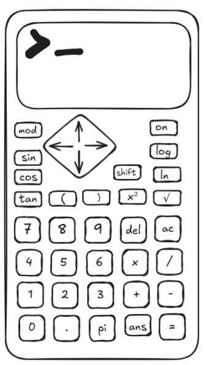
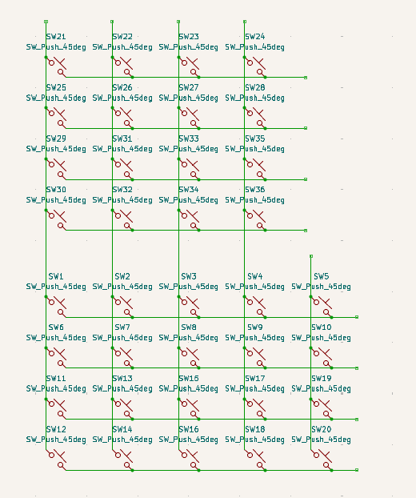
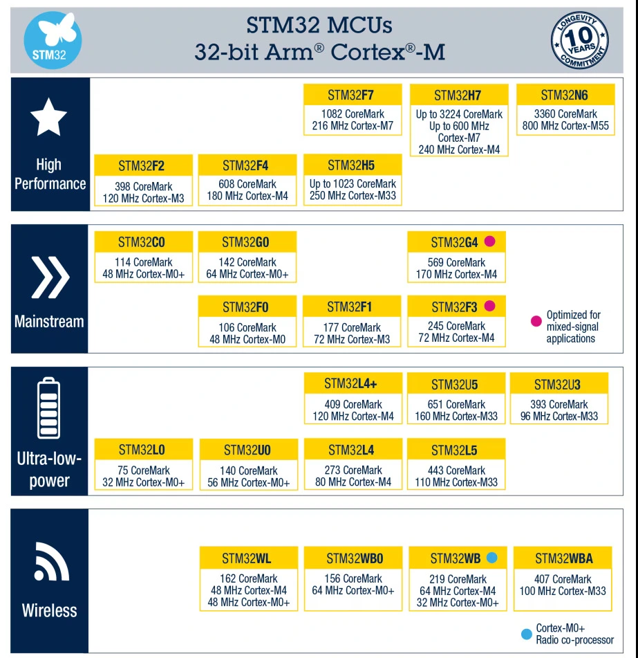
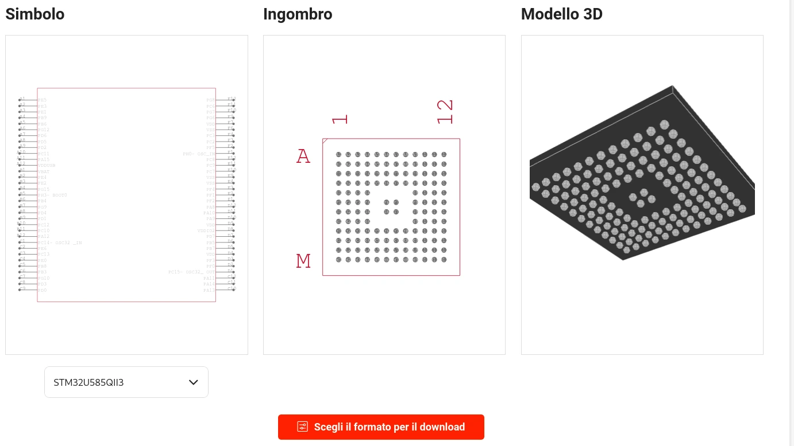
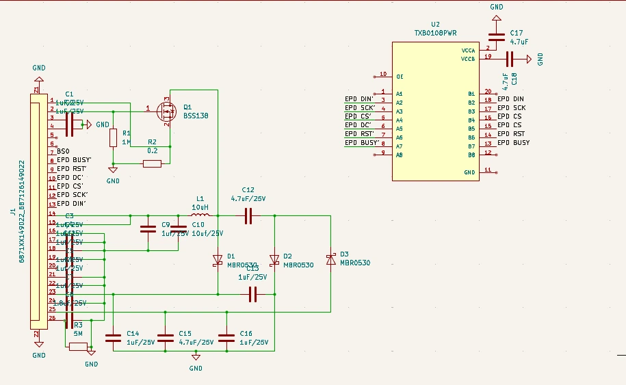

# Project Journal: Calculettissimo

---

## Hours Spent (so far)

| Hours Spent |
|-------------|
| 10           |

---

## Day 1: I Don't Know What I'm Doing  
**Date:** 25/05/2025  
**Hours spent:** ~4

Uhh, let's start this journal, shall we?  

### Progress  
1. **Initial Sketch**  
    I started by sketching out the rough outline of my calculator.  
      

2. **PCB Design**  
    I then moved on to starting the PCB part of it, so I made a matrix.  
      

### Next Steps  
I will report back when I find a processor and figure out the battery part.

### Edit: Processor Selection  
STM32 CPUs seem really cool. I'll choose between the STM32L4(+) or the STM32U5 (both have good memory capacity and low power consumption).  

---

## Day 2: BOM Figured Out?
**Date:** 26/05/2025  
**Hours spent:** ~3

I decided I want an e-ink display for this calculator, and this [2.36-inch E-Paper Module](https://www.waveshare.com/product/displays/e-paper/2.36inch-e-paper-module-g.htm) looks pretty good.
Since the calculator will be off most of the time, I'll probably keep the processor in a pretty deep sleep mode.

### Power Consumption Comparison

| Processor | Shutdown Mode | Standby Mode |
|-----------|---------------|--------------|
| STM32U5   | 160nA         | 210nA        |
| STM32L4   | 30-330nA      | 115-415nA    |

Note that the stm32u5 is wildly more powerful than the L4, but I really don't know what I'm doing, so I'll choose later :p

Also, I found [a 2.76v little solar panel](https://www.digikey.it/en/products/detail/anysolar-ltd/SM111K04L/9990435) and a smaller 2V one

[Digikey link for future reference](https://www.digikey.it/en/products/filter/solar-cells/514)

### Edit: Routing pain
I've decided to use the stm32u5 because of all its juicy features

Never routed a chip like this before though, wish me luck

## Day 3: Cyao stop asking me to put an fpga in this thing
**Date:** 28/05/2025  
**Hours spent:** ~3

I finally decided a processor to put in this thing, the [STM32U5A5RJT6](https://jlcpcb.com/partdetail/Stmicroelectronics-STM32U5A5RJT6/C22454506), it's an stm32u5, so plenty fast yet can go to sleep really nicely.

Time to read the datasheet, and then figure out how to wire everything up nicely

[datasheet](./pics/cpu.pdf) is in /pics/cpu.pdf

Then I started copying the schematic of the [screen driver board](https://files.waveshare.com/upload/5/5c/2.36inch_e-Paper_Module.pdf) so that I can just plug the screen in nicely.

This took a loong time (not even finished as of now).

